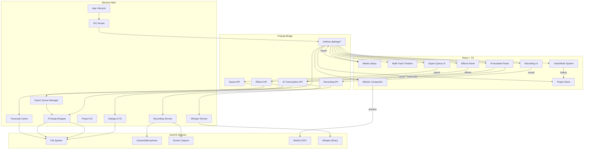

# ClipForge – Architecture v2 (Multi-Track & Professional Features)

## 0) Context & Goals
Build a professional desktop video editor with multi-track timeline, real recording capabilities, effects system, and export queue management. Extend the v1 MVP with advanced features while maintaining performance and stability.

**Key v2 additions:** Multi-track support, PiP recording, text overlays, transitions, export presets, undo/redo, onboarding experience, AI filler removal.

---

## 1) High-Level Architecture

**Process topology**
- **Electron Main (Node):** App lifecycle, window, menus, dialogs, secure IPC, project I/O, **fluent-ffmpeg** library invocation, **recording service**, **export queue manager**, **whisper runner**, **transcript cache**.
- **Preload (ContextBridge):** Extended API surface with recording, effects, queue management, and AI transcription.
- **Renderer (React + TS):** Multi-track UI, state management, preview compositor, recording orchestration, effects system, AI assistant panel.
- **External binaries:** Bundled `ffmpeg` & `ffprobe` in `process.resourcesPath/bin/`, `whisper.cpp` in `process.resourcesPath/bin/whisper/`, model files in `process.resourcesPath/models/whisper/`.

**Key principles**
- **Multi-track state:** Flat `trackItems` with `trackId` for undo/redo compatibility
- **Real-time preview:** WebGL compositor + CSS filters for effects
- **Professional recording:** desktopCapturer + getUserMedia with PiP muxing
- **Export queue:** Persistent job management with crash recovery
- **Performance:** Virtualization, throttling, GPU acceleration

---

## 2) Technology Choices & Extensions

| Choice | v1 Rationale | v2 Extensions |
|---------|-------------|---------------|
| **Electron** | `desktopCapturer` for screen capture | Enhanced with PiP recording, export queue |
| **React + TypeScript** | Developer familiarity, component model | Multi-track components, effects system |
| **FFmpeg/FFprobe** | Zero external deps; consistent behavior | Extended with overlay filters, drawtext |
| **fluent-ffmpeg** | Reliable progress parsing | Queue management, job persistence |
| **HTML5 `<video>`** | Simplicity for preview | Enhanced with WebGL compositor |
| **DOM Timeline** | Low complexity, quick to ship | Multi-track virtualization, snap-to-grid |
| **Zustand** | Minimal boilerplate | Extended with undo/redo middleware |

**New additions:**
- **WebGL Compositor:** OffscreenCanvas for multi-track preview
- **Proxy Media:** 540p proxies for heavy timelines
- **Recording Service:** MediaRecorder wrapper with PiP muxing
- **Export Queue:** Job management with persistence
- **Effects System:** CSS preview + FFmpeg export
- **Whisper Runner:** Local speech-to-text via Whisper.cpp
- **Transcript Cache:** File-hash based caching for transcripts
- **Filler Detection:** Pure functions for filler word detection
- **Cut Plan Generator:** Timeline mutation planner (pure function)

---

## 3) Multi-Track Architecture

### 3.1 State Management
```typescript
type TrackItem = {
  id: string
  clipId: string
  trackId: string        // NEW: Track association
  inSec: number
  outSec: number
  trackPosition: number
}

type Track = {
  id: string
  kind: 'video' | 'overlay' | 'audio'
  order: number
  items: TrackItem[]
}

type ClipForgeState = {
  project: ProjectInfo
  clips: Record<string, Clip>
  trackItems: Record<string, TrackItem>  // Flat for undo/redo
  tracks: Record<string, Track>          // Track metadata
  ui: {
    playheadSec: number
    zoom: number
    selectedId?: string
    isPlaying: boolean
  }
}
```

### 3.2 Timeline Rendering
- **Multi-track rows:** Each track renders as horizontal row
- **Virtualization:** Only visible track items render
- **Scroll sync:** Throttled sync between tracks and ruler (30fps)
- **Snap-to-grid:** Magnetic alignment for precise editing
- **Trim handles:** Visual resize controls on track items

---

## 4) Recording System

### 4.1 Recording Pipeline
```typescript
// Screen capture
desktopCapturer.getSources() → MediaRecorder

// Webcam capture  
getUserMedia({ video: true, audio: true }) → MediaRecorder

// PiP muxing
ffmpeg -i screen.webm -i webcam.webm 
  -filter_complex "[1]scale=320:240[v2]; [0][v2]overlay=W-w-20:H-h-20"
  output.webm
```

### 4.2 Recording Service
```typescript
class RecordingService {
  async startScreenRecording(sourceId: string): Promise<void>
  async startWebcamRecording(): Promise<void>
  async startPiPRecording(screenSource: string, webcamDevice: string): Promise<void>
  async stopRecording(): Promise<string> // Returns file path
  onRecordingComplete: (path: string, metadata: any) => void
}
```

### 4.3 Auto-Import Flow
1. Recording completes → saved to `~/Movies/ClipForge/recordings/`
2. Auto-probe metadata using FFprobe
3. Add to media library with UUID filename
4. Ready for timeline use

---

## 5) AI Assistant System

### 5.1 Whisper Integration
```typescript
class WhisperRunner extends EventEmitter {
  transcribe(audioPath: string, modelPath: string): Promise<Transcript>
  // Emits 'progress' events during transcription
}

// Transcript cache
class TranscriptCache {
  getCachedTranscript(hash: string): Promise<Transcript | null>
  setCachedTranscript(hash: string, transcript: Transcript): Promise<void>
  invalidateTranscript(hash: string): Promise<void>
}
```

### 5.2 Transcription Pipeline
1. **Audio Extraction:** FFmpeg converts video → 16kHz mono WAV
2. **Whisper Processing:** `whisper -m ggml-base.en.bin -f temp.wav -ofjson -pp -l en`
3. **JSON Parsing:** Extract word-level timestamps with confidence scores
4. **Cache Storage:** Save to `~/.clipforge/cache/transcripts/{hash}.json`
5. **Progress Events:** Emit IPC events for UI progress bar

### 5.3 Filler Detection
```typescript
// Pure function in src/shared/ai/
function detectFillerSpans(
  transcript: Transcript,
  options?: { confMin?: number; padMs?: number }
): FillerSpan[]

// Filler dictionary
const FILLERS = ["um", "uh", "like", "you know", "so", "actually", "well"]

// Returns padded spans (±40ms) with merge logic (≤120ms gaps)
```

### 5.4 Cut Plan Generation
```typescript
// Pure function - no side effects, fully testable
function generateCutPlan(
  trackItems: TrackItem[],
  fillerSpans: FillerSpan[],
  options?: { rippleGapMs?: number }
): CutPlan[]

// Respects existing trim bounds (inSec/outSec)
// Maps clip-relative times to timeline-relative
// Applies ripple tighten (merge gaps < snapInterval)
```

### 5.5 Timeline Application
```typescript
// Store mutation with undo snapshot
function applyCutPlanToStore(cutPlan: CutPlan[]): void {
  // 1. Snapshot current trackItems
  // 2. Split items according to cuts
  // 3. Batch mutations (add fragments, remove originals)
  // 4. Adjust playhead if needed
  // 5. Store snapshot for undo
}
```

### 5.6 File Hash Calculation
```typescript
// Calculated at file ingest time
function calculateClipHash(fileBuffer: Buffer): string {
  return crypto.createHash('sha1').update(fileBuffer).digest('hex')
}

// Stored in Clip.hash for cache lookup
```

---

## 6) Effects & Preview System

### 6.1 Dual-Tier Preview
**Tier 1 - Real-time Preview:**
- WebGL compositor using OffscreenCanvas
- CSS filters for color adjustments
- DOM-based text overlays
- Target: ≥30 fps with effects

**Tier 2 - Proxy Media:**
- 540p proxies for heavy timelines
- Generated on import via FFmpeg
- Switched automatically for performance
- Target: ≥55 fps for complex projects

### 6.2 Effects Pipeline
```typescript
// Preview (CSS/WebGL)
const previewEffects = {
  brightness: 'brightness(1.2)',
  contrast: 'contrast(1.1)',
  saturation: 'saturate(1.3)'
}

// Export (FFmpeg)
const exportFilters = {
  brightness: 'eq=brightness=0.2',
  contrast: 'eq=contrast=1.1',
  saturation: 'eq=saturation=1.3'
}
```

### 6.3 Text Overlays
```typescript
type TextOverlay = {
  id: string
  text: string
  font: string
  size: number
  color: string
  position: { x: number, y: number }
  animation: 'fade' | 'slide' | 'zoom'
  startTime: number
  endTime: number
}
```

---

## 7) Export Queue System

### 7.1 Job Management
```typescript
type ExportJob = {
  id: string
  status: 'pending' | 'processing' | 'completed' | 'failed'
  progress: number
  preset: string
  outputPath: string
  createdAt: string
  // Saved to ~/.clipforge/queue.json
}

class ExportQueue {
  jobs: ExportJob[]
  addJob(job: ExportJob): void
  processNext(): Promise<void>
  cancelJob(jobId: string): void
  retryJob(jobId: string): void
}
```

### 7.2 Export Presets
```typescript
const presets = {
  youtube: {
    resolution: '1920x1080',
    framerate: 30,
    codec: 'libx264',
    preset: 'medium',
    crf: 20
  },
  tiktok: {
    resolution: '720x1280', // Vertical
    framerate: 30,
    codec: 'libx264',
    preset: 'fast',
    crf: 23
  },
  instagram: {
    resolution: '1080x1080', // Square
    framerate: 30,
    codec: 'libx264',
    preset: 'fast',
    crf: 23
  }
}
```

### 7.3 Queue Persistence
- Jobs saved to `~/.clipforge/queue.json`
- Auto-resume on app startup
- Crash recovery for interrupted exports
- Progress tracking via IPC events

---

## 8) Performance Optimizations

### 8.1 Timeline Performance
- **Virtualization:** Only visible track items render
- **Scroll throttling:** 30fps updates for smooth scrolling
- **GPU transforms:** Hardware-accelerated playhead movement
- **Memory management:** Cleanup unused track items

### 8.2 Preview Performance
- **WebGL compositor:** Hardware-accelerated rendering
- **Proxy media:** 540p proxies for heavy timelines
- **Effect caching:** Pre-computed filter chains
- **Frame dropping:** Adaptive quality based on performance

### 8.3 Export Performance
- **Single-pass encoding:** All effects in one FFmpeg process
- **Hardware acceleration:** Use available GPU codecs
- **Progress optimization:** Throttled progress updates
- **Memory efficiency:** Stream processing for large files

---

## 9) Component Diagram v2



---

## 10) Data Flow Examples

### 9.1 Multi-Track Editing
1. User drags clip to timeline
2. Store adds `TrackItem` with `trackId`
3. Timeline renders clip in correct track row
4. Undo system records state change
5. Auto-save triggers after 15 seconds

### 9.2 PiP Recording
1. User selects screen source + webcam device
2. Recording service starts dual capture
3. MediaRecorder saves separate streams
4. FFmpeg muxes with overlay filter
5. Auto-imports result to media library

### 9.3 Effects Export
1. User adds text overlay to timeline
2. Preview renders via WebGL compositor
3. Export builds FFmpeg filter_complex
4. Includes `drawtext` filter for text
5. Single-pass encode with all effects

### 9.4 AI Filler Removal Pipeline
1. User selects clip in media library
2. Click "Analyze Speech" → Extract audio to 16kHz WAV
3. Whisper.cpp transcribes with word-level timestamps
4. Transcript cached by file hash in `~/.clipforge/cache/transcripts/`
5. Filler detection scans transcript for filler words
6. User previews detected fillers, adjusts confidence threshold
7. Generate cut plan (pure function, respects existing trims)
8. Apply cuts to timeline (batched mutations, single undo entry)
9. Playhead adjusted if inside removed region

---

## 11) IPC Surface Extensions

```typescript
// Existing v1 API
openFiles(): Promise<string[]>
probe(path: string): Promise<{duration:number;width:number;height:number}>
exportTimeline(project: Project, out: string): Promise<void>
saveProject(project: Project, path?: string): Promise<string>
openProject(): Promise<Project|null>

// New v2 API
startRecording(type: 'screen' | 'webcam' | 'pip', options: RecordingOptions): Promise<void>
stopRecording(): Promise<string>
getRecordingSources(): Promise<RecordingSource[]>
addTextOverlay(overlay: TextOverlay): Promise<void>
exportWithPreset(project: Project, preset: string, outputPath: string): Promise<string>
getExportQueue(): Promise<ExportJob[]>
cancelExportJob(jobId: string): Promise<void>
undo(): Promise<void>
redo(): Promise<void>

// AI Assistant API
transcribeClip(clipId: string): Promise<Transcript>
onTranscribeProgress(callback: (data: { clipId: string; progress: number }) => void): void
detectFillers(clipId: string, options?: { confMin?: number }): Promise<FillerSpan[]>
generateCutPlan(trackItems: TrackItem[], fillerSpans: FillerSpan[], options?: { rippleGapMs?: number }): Promise<CutPlan[]>
applyCutPlan(cutPlan: CutPlan[]): Promise<void>
undoLastAICuts(): Promise<void>
```

---

## 12) Performance Targets

| Metric | v1 Target | v2 Target |
|--------|-----------|-----------|
| Timeline scroll | ≥55 fps | ≥55 fps (5+ tracks) |
| Export speed | ≤1.3× realtime | ≤1.3× realtime |
| Preview with effects | N/A | ≥30 fps |
| Recording quality | N/A | 1080p30 + 720p PiP |
| Memory usage | <1GB | <2GB |
| Startup time | ≤5s | ≤3s |

---

## 13) Risk Mitigation

| Risk | v1 Mitigation | v2 Mitigation |
|------|----------------|---------------|
| Whisper binary missing | Path resolution + error handling | Graceful degradation, user-friendly errors |
| Transcription timeout | Progress tracking | Timeout handling, retry mechanism |
| Large file processing | Cache system | Hash-based cache, avoid re-transcription |
| Filler detection accuracy | Confidence threshold | User-adjustable slider, preview before apply |
| Timeline mutation errors | Pure cut plan function | Undo snapshot, batch mutations |

| Risk | v1 Mitigation | v2 Mitigation |
|------|----------------|---------------|
| Export failures | Single-pass encode | Queue persistence + retry |
| Performance | Virtualization | WebGL + proxy media |
| Audio sync | PTS re-timestamp | Enhanced PTS handling |
| Multi-track complexity | N/A | Flat state + trackId |
| Recording CPU load | N/A | Hardware decode + GPU |

---

## 14) Acceptance Criteria v2

### 14.1 Core Features
- [ ] Multi-track timeline with drag-drop between tracks
- [ ] Screen + webcam recording with PiP
- [ ] Text overlays with animations
- [ ] Basic transitions (crossfade, slide, dip-to-black)
- [ ] Export queue with presets
- [ ] Undo/redo system (50 actions)
- [ ] Onboarding tour for new users
- [ ] AI filler removal:
  - [ ] Local Whisper.cpp transcription
  - [ ] Transcript caching by file hash
  - [ ] Filler detection with confidence threshold
  - [ ] Preview and selective removal
  - [ ] Timeline cuts respect existing trims
  - [ ] Single undo for AI edits

### 14.2 Performance
- [ ] Timeline rendering: ≥55 fps with 5+ tracks
- [ ] Preview with effects: ≥30 fps
- [ ] Export speed: ≤1.3× realtime for 1080p30
- [ ] Memory usage: <2GB for typical projects
- [ ] Startup time: <3 seconds
- [ ] AI transcription: Non-blocking UI, progress updates
- [ ] Transcript cache: Instant lookup for previously transcribed clips

### 14.3 User Experience
- [ ] Recording setup: <30 seconds
- [ ] Timeline editing: Intuitive multi-track workflow
- [ ] Export workflow: <5 clicks to export
- [ ] Error recovery: Graceful degradation
- [ ] Onboarding: Complete tour in <2 minutes
- [ ] AI workflow: Analyze → Preview → Apply in <5 clicks
- [ ] Filler detection: Confidence threshold adjustment with real-time updates

---

## 15) Implementation Phases

### Phase 1: Multi-Track Foundation
- Track management in Zustand store
- Multi-track timeline rendering
- Drag-drop between tracks
- Track ordering and visibility

### Phase 2: Recording System
- Screen recording implementation
- Webcam recording support
- PiP recording with muxing
- Auto-import workflow

### Phase 3: Effects & Preview
- Text overlay system
- Basic transitions
- WebGL compositor
- Proxy media system

### Phase 4: Export & Polish
- Export queue management
- Preset system
- Undo/redo implementation
- Onboarding experience

### Phase 5: AI Assistant
- Whisper.cpp integration and binary bundling
- Transcript cache system
- Filler detection algorithms
- Cut plan generation (pure functions)
- Timeline mutation application
- AI Assistant UI panel

---

## 16) Future Considerations

### 16.1 Advanced Features
- LUT color grading
- Motion-tracked text
- GPU-accelerated filters
- Real-time collaboration
- Cloud project sync
- AI enhancements:
  - Multiple language support
  - Custom filler word dictionaries
  - Advanced confidence analysis
  - Batch processing across multiple clips
  - MCP server for AI agent integration

### 15.2 Platform Expansion
- Windows support
- Linux support
- Mobile companion
- Web-based editor

---

*This architecture v2.0 extends v1.0 with professional editing capabilities while maintaining the core principles of simplicity, performance, and reliability.*
